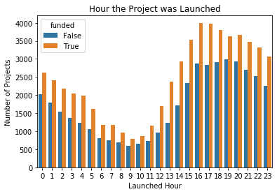
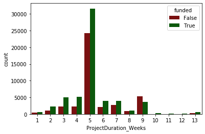
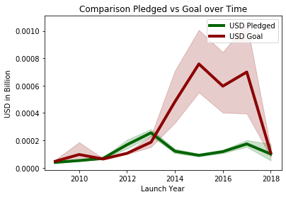

# Objectives
In this project, we focus more on the exploratory data analysis of kickstart projects to extract the pattern of funded projects and the role of covariates such as backers support for the project  before dealing with the actual data analytics using  machine learning algorithms.

# Project Roadmap

We determine to predict using the features of kickstart projects whether the project is funded or not. Towards this end, we clean and preprocess the data sets and ananlyse the importance of individual features, relationship among features. We derived a few new features which deemed good in predictitability of the project. We then employ the patterns among these features for prediction using K-nearest neigbhours and Decision tree classifier. The Performance of both the methods are compared in terms of average prediction accuracy. We also breifly discuss the importance of features in prediction

1.Data cleaning and Derivation of three new features
2. Exploratory data analysis
3. Prediction analysis, using knn (given estimator)
4. Chosing the value of parameter k using validation set
    decision-tree classifier (additional estimator)
5. Chosing the number of branched using validation set
6. Performance of prediction
7. Feature selection (importance of features)

## A few interesting observation from out exploratory data analysis are indicated below:

### When the projects are more often launched?

From the plot below  there are more projects launched either in the early morning (between 0 am and 5 am) and more projects launched in the late afternoon/evening (between 4 and 23 pm) compared to the time between 7 am and 3 pm.

### Duration of project life:

We observed from our analysis  that most projects are put on Kickstarter for about 5 weeks and almost all projects are live between 1 and 9 weeks (more than 2 months) as indicated in the figure below.

Also, the proportion between funded  and non-funded projects varies over time: Projects with a short run time (1–7weeks) succeed relatively more often compared to projects that are launched with a medium to long run time (9  weeks). This insight could support the hypothesis that project are not more likely to funded when they live long for a long time so that the more the people have the chance to see it over time, the more likely it will succeed.  But from our current data it does not appear so.

### The pattern of Goal vs. Pledged amount

It can be seen from the figure below that the accumulated goal amount  sharply increases from 2013 and has its peak in 2015 before it slowly decreases. On the other hand, the accumulated pledged amount for each year steadily decreases but rather linearly. It actually decreased slightly from 2013 to 2016.  

